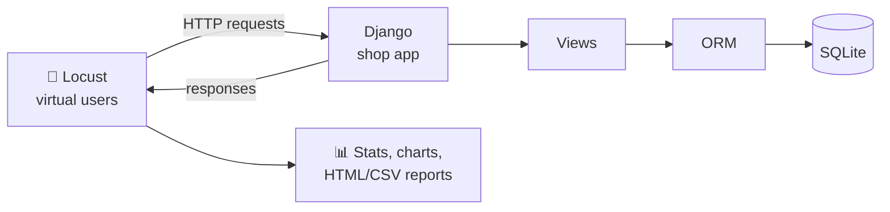

<div align="center">

# 🦗 Locust Load Testing Playground

**Learn load testing by doing: a small Django shop API, a login test page, and a Locust test suite that hammers it.**


[Quick start](#-quick-start) •
[Endpoints](#-api-endpoints) •
[Run Locust](#-run-the-load-tests) •
[Results](#-what-the-tests-showed) •
[Concepts](#-concepts-cheat-sheet) •
[Troubleshooting](#-troubleshooting)

</div>

---

## 📖 About

This project is a hands-on way to learn **[Locust](https://locust.io)**, a Python load testing tool. It has two parts:

| Part | Folder | What it does |
|---|---|---|
| 🛒 **Target app** | `backend/` | A tiny Django shop with products, login, and a protected profile endpoint |
| 🦗 **Load tests** | `locust_tests/` | Virtual users that browse, log in, and trigger 404s, with HTML/CSV reports |

> ⚠️ **Only load test systems you own or have permission to test.** Pointing Locust at someone else's site can look like a denial-of-service attack.

## ✨ Features

- ✅ Django JSON API with product list, product detail, login, and profile
- ✅ Session-based login that Locust users perform once in `on_start`
- ✅ Weighted tasks that mimic real traffic (browsing is more common than visiting home)
- ✅ Expected 404s counted as success using `catch_response`
- ✅ Browser login test page at `/login-page/`
- ✅ Django unit tests for the auth flow
- ✅ Headless runs that save HTML and CSV reports

## 🧭 Architecture



## 📁 Project structure

```
locust-practice/
├── backend/                     # Django project (the system under test)
│   ├── manage.py
│   ├── shop/                    # project settings and root URLs
│   └── store/                   # the app
│       ├── models.py            # Product model
│       ├── views.py             # API views + login page view
│       ├── urls.py              # routes
│       ├── tests.py             # auth tests
│       └── templates/store/
│           └── login_page.html  # browser page to try login
├── locust_tests/
│   ├── locustfile.py            # virtual user behavior
│   └── reports/                 # generated reports (git-ignored)
├── requirements.txt
└── .gitignore
```

## 🔌 API endpoints

| Method | URL | Auth | Description |
|---|---|---|---|
| `GET` | `/` | none | Welcome message |
| `GET` | `/products/` | none | List all products (one DB query) |
| `GET` | `/products/<id>/` | none | One product, or `404` if missing |
| `POST` | `/login/` | none | JSON `{"username", "password"}`; sets a session cookie |
| `GET` | `/profile/` | session | Returns the username, or `401` if not logged in |
| `GET` | `/login-page/` | none | HTML page to test login and profile in the browser |

## 🚀 Quick start

**Prerequisite:** Python 3.12 or newer.

<details open>
<summary><b>🪟 Windows (PowerShell)</b></summary>

```powershell
git clone https://github.com/<your-username>/<your-repo>.git
cd <your-repo>

python -m venv venv
venv\Scripts\activate
pip install -r requirements.txt
```

If activation is blocked, run this once and try again:

```powershell
Set-ExecutionPolicy -Scope Process -ExecutionPolicy Bypass
```

</details>

<details>
<summary><b>🐧 macOS / Linux</b></summary>

```bash
git clone https://github.com/<your-username>/<your-repo>.git
cd <your-repo>

python3 -m venv venv
source venv/bin/activate
pip install -r requirements.txt
```

</details>

### 1. Prepare the database

```bash
cd backend
python manage.py migrate
```

Create 20 sample products and the test user (one command, works in PowerShell and bash):

```bash
python manage.py shell -c "from store.models import Product; from django.contrib.auth.models import User; Product.objects.bulk_create([Product(name=f'Product {i}', price=i*10) for i in range(1, 21)]); User.objects.create_user('testuser', password='testpass123')"
```

### 2. Start the server

```bash
python manage.py runserver
```

Leave this terminal running, then open <http://127.0.0.1:8000/products/>. You should see 20 products as JSON. ✅

## 🔐 Try the login page

Open <http://127.0.0.1:8000/login-page/> and walk through this checklist:

- [ ] Click **Check profile** (not logged in) → `401 unauthorized`
- [ ] Enter a wrong password, click **Login** → `401 invalid credentials`
- [ ] Use `testuser` / `testpass123`, click **Login** → `200 logged in`
- [ ] Click **Check profile** → `200` with `"username": "testuser"`

> 💡 Browsers keep the session cookie, so to repeat the "not logged in" check, use an **incognito window** or clear the site's cookies.

## 🧪 Run the Django tests

```bash
cd backend
python manage.py test
```

Tests run on a temporary database, so your real data is never touched.

## 🦗 Run the load tests

Keep `runserver` running, open a **second terminal**, activate the venv, and:

```bash
cd locust_tests
```

### Option A: Web UI

```bash
locust -f locustfile.py --host http://127.0.0.1:8000
```

Open <http://localhost:8089>, set **Number of users** to `10` and **Ramp up** to `2`, then click **Start**. Click **Stop** when done, and press `Ctrl+C` to quit Locust.

### Option B: Headless (stops by itself, saves reports)

```bash
locust -f locustfile.py --host http://127.0.0.1:8000 --headless -u 20 -r 2 -t 1m --html=reports/report.html --csv=reports/results
```

<details>
<summary><b>What do these flags mean?</b></summary>

| Flag | Meaning |
|---|---|
| `-f` | Locustfile to run |
| `--host` | Base URL of the app being tested |
| `--headless` | Run without the web UI |
| `-u 20` | 20 virtual users |
| `-r 2` | Spawn rate: add 2 users per second |
| `-t 1m` | Run for 1 minute, then stop |
| `--html` | Write a shareable HTML report |
| `--csv` | Write CSV result files |

</details>

### 📄 The locustfile

The full test is in [`locust_tests/locustfile.py`](locust_tests/locustfile.py). It defines one `ShopUser` that logs in once in `on_start`, then repeats the weighted tasks below.

### 🎲 Task weights

| Task | Endpoint | Weight | Share of traffic |
|---|---|---|---|
| Product detail | `/products/<random 1-20>/` | 5 | ~42% |
| Product list | `/products/` | 3 | ~25% |
| Profile | `/profile/` | 2 | ~17% |
| Home | `/` | 1 | ~8% |
| Missing product (expects 404) | `/products/9999/` | 1 | ~8% |

## 📊 What the tests showed

A real run of this project: **20 users, 59 seconds, 560 requests, 0 failures, about 9.5 requests/second.**

| Endpoint | Avg response |
|---|---|
| `POST /login/` | ~994 ms 🐢 |
| `GET /products/` | ~7 ms |
| `GET /products/[id]/` | ~7 ms |
| `GET /profile/` | ~8 ms |

**Key findings**

1. 🔑 **Login is the slowest endpoint by far.** Django hashes passwords with a deliberately expensive algorithm, so each login costs about a second of CPU.
2. 📈 **Ramp-up speed changes what you measure.** With 50 users, spawning 5 per second pushed login to a ~4.9 s median, while 1 per second kept it near ~1.5 s, because the logins no longer queued behind each other.
3. 🧮 **Little's Law checks out:** `RPS ≈ users / (response time + wait time)`, so 20 users with a ~2 s wait gives about 10 RPS.
4. 🎯 **Read per-endpoint rows, not the aggregate.** A few slow logins pulled the aggregated average up even though every page was fast.

## 📚 Concepts cheat sheet

<details>
<summary><b>Click to expand the key ideas</b></summary>

| Term | Meaning |
|---|---|
| **Virtual user** | A simulated user (not a browser) running your Python behavior |
| **`@task(n)`** | An action a user performs; `n` is its relative weight |
| **`wait_time`** | Think time between tasks, like a real person pausing |
| **`self.client`** | The user's HTTP client; keeps cookies, so logins persist |
| **`on_start`** | Runs once per user when it spawns (login goes here) |
| **`name=`** | Groups many URLs into one stats row |
| **`catch_response`** | Lets you decide what counts as success or failure |
| **Spawn rate** | How many users are added per second |
| **RPS** | Requests per second (throughput) |
| **p95 / p99** | 95% / 99% of requests were at or under this time |

**Why percentiles beat averages:** the average hides the slow tail. A p99 of 4 seconds means 1 in 100 requests felt very slow, even if the average looks fine.

</details>

## 🛠️ Troubleshooting

<details>
<summary><b><code>TemplateDoesNotExist</code> at <code>/login-page/</code></b></summary>

Django scans for template folders only when the server starts. If you created `templates/` while `runserver` was running, stop the server fully (`Ctrl+C`) and start it again. Also check that `"store"` is in `INSTALLED_APPS`.

</details>

<details>
<summary><b><code>/login/</code> shows 405 Method Not Allowed in the browser</b></summary>

That is expected. The view only accepts `POST`, and the address bar sends `GET`. Use `/login-page/` or Locust instead.

</details>

<details>
<summary><b>Check profile says "logged in" with empty fields</b></summary>

The button never reads the input boxes. It sends your existing session cookie. Use an incognito window to test the logged-out case.

</details>

<details>
<summary><b>Locust shows connection errors</b></summary>

Make sure `runserver` is running in another terminal and that `--host` matches its address (`http://127.0.0.1:8000`).

</details>

<details>
<summary><b>Import error: <code>locust</code> not found in VS Code</b></summary>

Press `Ctrl+Shift+P`, choose **Python: Select Interpreter**, and pick the one inside the project's `venv`.

</details>

## ⚠️ Notes

- `/login/` uses `@csrf_exempt` **for testing only**. Do not copy that into a real login form.
- The app runs with `DEBUG=True` and Django's development server, so absolute numbers are only a learning baseline, not a production benchmark.
- Locust and Django share one machine here, so they compete for CPU.

## 🗺️ Roadmap

- [x] Django target app with products, login, and profile
- [x] Weighted tasks, login in `on_start`, 404 validation
- [x] Headless runs with HTML and CSV reports
- [x] Django auth tests and browser login page
- [ ] Multi-step shopping journey with `SequentialTaskSet`
- [ ] Pass/fail thresholds for CI (fail the run if p95 is too slow)
- [ ] Custom load shapes (ramp, spike, soak)
- [ ] Distributed testing with master and workers

## 🤝 Contributing

This is a personal learning project, but suggestions are welcome. Open an issue or a pull request.

## 📄 License

Add a license of your choice (for example MIT) before publishing.

---

<div align="center">

Built while learning Locust 🦗 · If this helped you, give it a ⭐

</div>